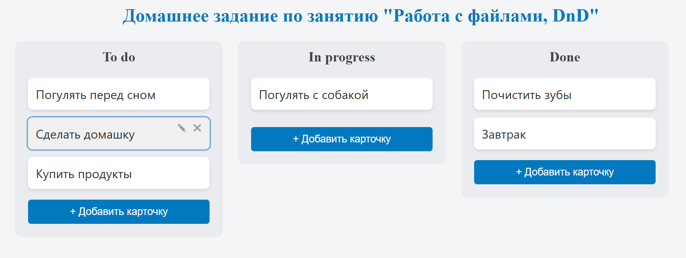
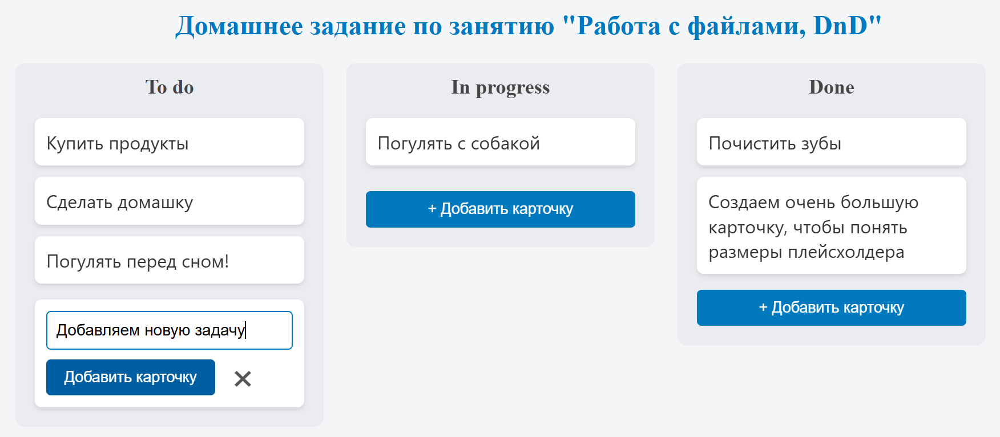
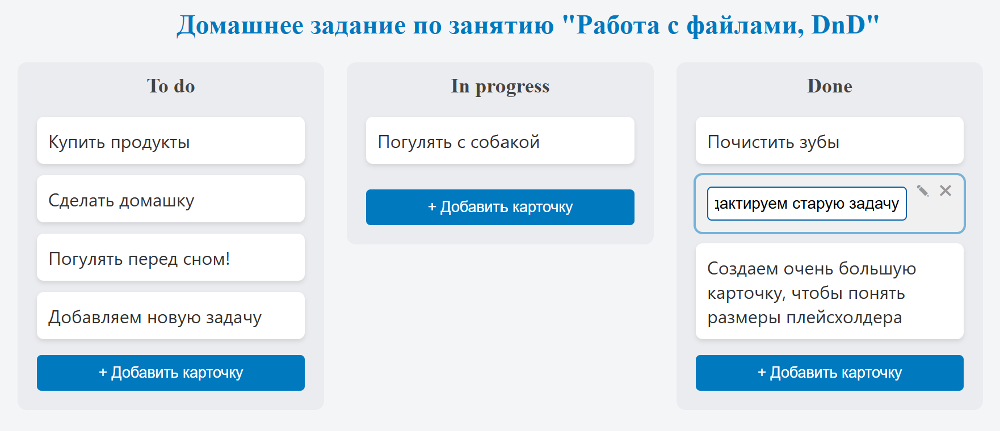

# Trello-подобное приложение (учебный проект)

---

### Статус проекта
[](https://ci.appveyor.com/project/dm-morozov/netology-56-file-handling-dnd)


[**Ссылка на проект на GitHub Pages**](https://dm-morozov.github.io/Netology_56_file_handling_dnd/)

---

### Описание проекта



Это учебный проект, созданный в рамках домашнего задания к занятию [**"6. Работа с файлами, DnD"**](./ahj-homeworks-AHJ-50/dnd/README.md) в Нетологии. Цель проекта — разработать упрощённый аналог популярного менеджера задач Trello, сфокусировавшись на базовой логике и механизмах перетаскивания (Drag-and-Drop).

### Реализованный функционал


* **Добавление карточек**: Возможность добавлять новые карточки в каждую из трёх колонок.

* **Удаление карточек**: Карточки можно удалять, кликнув на иконку крестика, которая появляется при наведении.
* **Редактирование карточек**: Текст карточки можно изменить по двойному клику или нажав на иконку карандаша. Редактирование происходит в интерактивном поле ввода.

* **Перемещение карточек**: Полностью реализован механизм Drag-and-Drop, позволяющий перемещать карточки:
    * **Между колонками**.
    * **Внутри одной колонки**, с динамическим плейсхолдером, который показывает место вставки.
* **Сохранение состояния**: Все изменения (добавление, удаление, перемещение) сохраняются в **LocalStorage** и восстанавливаются при обновлении страницы.
* **Сборка**: Проект собирается с помощью **Webpack** и использует **TypeScript**.

---

### Структура проекта

```

.
├── .github/                 # Настройки CI/CD для GitHub Actions
├── .husky/                  # Конфигурация Git хуков для контроля коммитов
├── .vscode/                 # Рекомендованные настройки и расширения для VS Code
├── src/
│   ├── css/                 # Стили приложения
│   │   └── style.css        # Основной CSS-файл
│   ├── ts/                  # Исходный TypeScript-код
│   │   ├── tests/           # Модульные тесты (если есть)
│   │   ├── interface.ts     # Описание интерфейсов Card и Column
│   │   ├── main.ts          # Инициализация приложения, точка входа для TS
│   │   └── TrelloApp.ts     # Основная логика Trello-приложения (классы, методы, DnD)
│   ├── index.html           # Главная HTML-страница приложения
│   └── index.ts             # Точка входа для сборки (импортирует main.ts)
├── svg/                     # SVG-иконки для README и интерфейса
├── .gitignore               # Список файлов и папок, игнорируемых Git
├── package.json             # Описание зависимостей и npm-скриптов
├── README.md                # Документация проекта
├── tsconfig.json            # Конфигурация TypeScript
└── webpack.*.mjs            # Конфигурация сборки Webpack

```

---

### Инструкции по запуску проекта

Для запуска проекта локально выполните следующие команды:

1.  Клонируйте репозиторий:
    `git clone https://github.com/dm-morozov/Netology_56_file_handling_dnd.git`
2.  Перейдите в директорию проекта:
    `cd Netology_56_file_handling_dnd`
3.  Установите зависимости с помощью **Yarn**:
    `yarn install`
4.  Запустите проект в режиме разработки:
    `yarn dev`
5.  Проект будет доступен по адресу `http://localhost:3000`.

---

## 📧 Контакты

Если возникнут вопросы, пишите:

*  [LinkedIn](https://www.linkedin.com/in/dm-morozov/)
*  [Telegram](https://t.me/dem2014)
*  [GitHub](https://github.com/dm-morozov/)

---